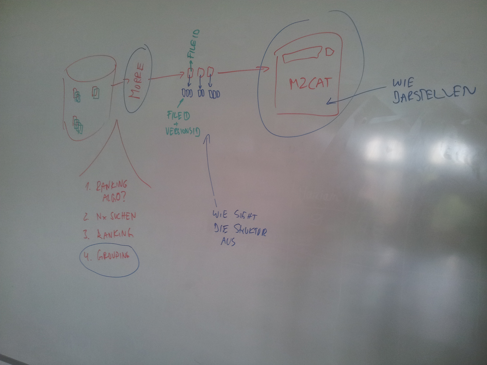
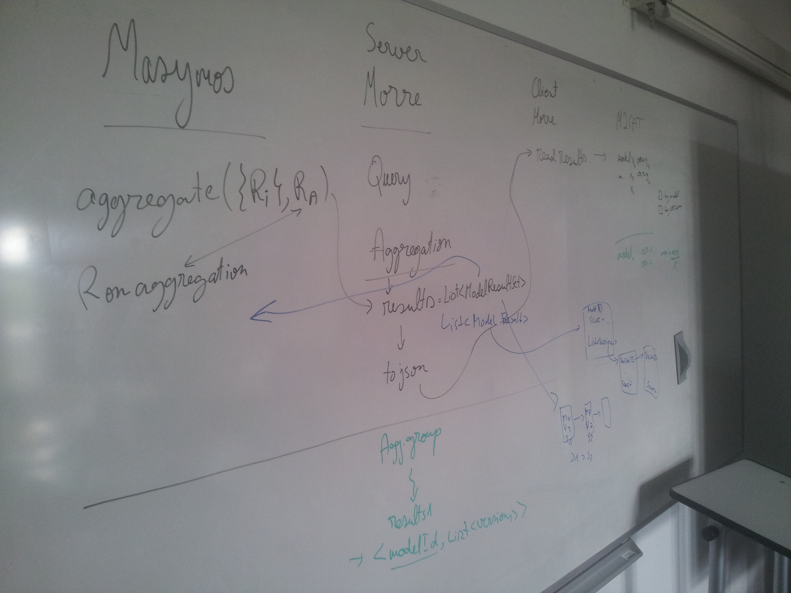

With the Versioning stuff introduced by MP with Search / Retrieval thing is broken. But not all is lost. Mariam can fix it! :)

Meeting 22.06.2016 
-------------------
We structured the todos:



* red is the published stuff
* green is the stuff made by MP
* blue is the todo

Meeting 27.06.2016 
-------------------

### State of the Arts 

Documents have these fields:
```
VERSIONID	7ecd2201f8f18c70ae73257a07c1af920ac1e5b2
META	{"source":"PMR2","versionDate":"15.01.1970-21:18:38","crawledDate":"11.08.2015-14:49:19"}
FILEID	urn:model:models.cellml.org:workspace:oyehaug_ostby_lloyd_ottersen_omholt_einevoll_2009:!:oyehaug_2009_version1.cellml
XMLDOC	http://taylor.informatik.uni-rostock.de/models/models.cellml.org/workspace/oyehaug_ostby_lloyd_ottersen_omholt_einevoll_2009/7ecd2201f8f18c70ae73257a07c1af920ac1e5b2/oyehaug_2009_version1.cellml
URI	http://taylor.informatik.uni-rostock.de/models/models.cellml.org/workspace/oyehaug_ostby_lloyd_ottersen_omholt_einevoll_2009/7ecd2201f8f18c70ae73257a07c1af920ac1e5b2/oyehaug_2009_version1.cellml
```
Models have these fields:
```
NAME	oyehaug_2009
ID	oyehaug_2009_1
```

Connections for Documents ```A` and `B`, Diff `C`, and Diffnode `E```:
```
A -[HAS_SUCCESSOR]-> B
B -[HAS_PREDECESSOR]-> A
# plus:
A -[HAS_DIFF]-> C -[HAS_DIFF]-> B
C -[HAS_DIFF_ENTRY]-> E {bives.attributes}
```

* first question: Does the naming make sense? HAS_DIFF for both pre- and postversion? should we rethink that? unrelated to this, see #4

If some app now asks morre for some search results, it gets some JSON array with results being JSON objects:

```json
[
    {
        "documentURI": "https://models.physiomeproject.org/exposure/d86b21d4e6bf68e94e20001a159fb9dd/adrian_chandler_hodgkin_1970.cellml",
        "filename": "adrian_chandler_hodgkin_1970.cellml",
        "indexSource": "ModelIndex",
        "modelID": "Adrian_Chandler_Hodgkin_Frog_Sartorius_1970",
        "modelName": "adrian_model_1970",
        "score": 0.14604965,
        "versionID": "509066630685501"
    },
    {
        "documentURI": "...",
        "filename": "...",
        "indexSource": "...",
        "modelID": "...",
        "modelName": "...",
        "score": ...,
        "versionID": "..."
    },
		....
]
```

I don't understand all values and there is no documetation available. Why do different models have the same ```modelID`? What is the model identifier? I guess the URI? But in this case its version specific, see `d86b21d4e6bf68e94e20001a159fb9dd```...

**MP:** The modelID is the same, because it was taken from the same repository (CellML) or has the same !BioModels ID. Therefore only the combination of modelID and versionID forms a unique 'primary key' if you like so. For a not so comprehensive explanation refer to http://sems.uni-rostock.de/trac/modelcrawler/wiki//WikiStart
Also please note, that the versionIDs don't follow an order. Look at them more like git commit hashes (which they are in case of CellML)

However to make confusion complete: There is a naming glitch between ```fileID` and `modelID```. If I'm remembering correctly the database already had a modelID, filled with the SBML document id...

**MS:** The modelID is not unique :(
for example, these two results are two different models:

```json
[
    {
        "documentURI": "https://models.physiomeproject.org/exposure/1e1bee6ef3243503e7e1531cfd61bb3f/novak_tyson_1993_a.cellml",
        "filename": "novak_tyson_1993_a.cellml",
        "indexSource": "ModelIndex",
        "modelID": "novak_1993",
        "modelName": "novak_1993",
        "score": 0.18896642,
        "versionID": "509209241194500"
    },
    {
        "documentURI": "https://models.physiomeproject.org/exposure/1e1bee6ef3243503e7e1531cfd61bb3f/novak_tyson_1993_b.cellml",
        "filename": "novak_tyson_1993_b.cellml",
        "indexSource": "ModelIndex",
        "modelID": "novak_1993",
        "modelName": "novak_1993",
        "score": 0.18896642,
        "versionID": "509209584337876"
    }
]
```

I'd rather suspect that documentURI and versionID is the primary key? As I remember, I've seen in your database on taylor, that the documentURI is the same for different versions of a model, even if it contains version information!? I'm not sure, but I think we should make that super-clear! ;-)

### Proposal 
Nevertheless, we propose the following structure:
* group all versions of a model into one single object
* this object contains all values as usual (plus/minus improvements)
* this object contains a key ```furtherMatches``` that contains an array of versions as objects with usual keys except redundant ones (e.g. there is no need to repeat the model id etc)

That means this:

```json
[
    {
        "score": 0.7,
        "modelID": "A",
        "versionID": "1"
    },
    {
        "score": 0.5,
        "modelID": "B",
        "versionID": "1"
    },
    {
        "score": 0.1,
        "modelID": "A",
        "versionID": "2"
    }
]
```
becomes this:

```json
[
    {
        "score": 0.7,
        "modelID": "A",
        "versionID": "1",
        "furtherMatches":
        [
            {
                "score": 0.1,
                "versionID": "2"
            }
        ]
    },
    {
        "score": 0.5,
        "modelID": "B",
        "versionID": "1"
    }
]
```

This way, old application still find all entries that they are looking for. Additionally, applications that are aware of versions may evaluate the array of ```furtherMatches```.

### Questions 
* what do you think about naming it ```furtherMatches```?
  * what about ```additionalMatches```
* why is ```modelID``` not unique in the database?
  * see above
* what does ```filename``` mean? why is that important?
  * maybe for CellML in repository resolution? Not sure though
* what's the value of ```versionID```?
  * the model crawler needs it to determine which version is already stored in the database :)

Meeting 2016-06-29 
-------------------

